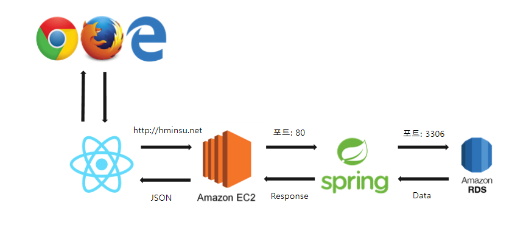
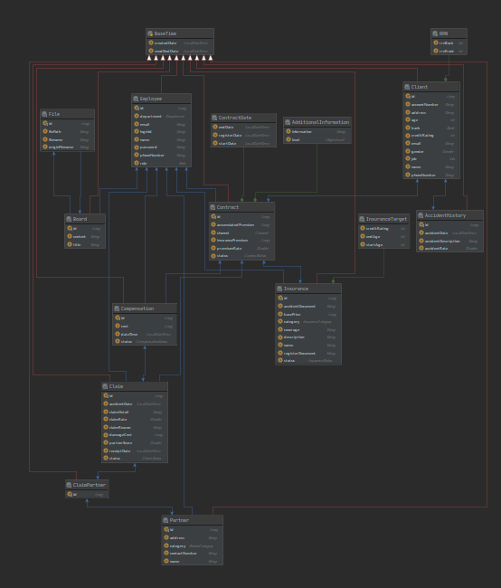

# HM 보험 API

# 목적

- 보험사 RFP를 읽고 요구사항을 분석하여 보험사 운영 시스템을 개발
- 보험 비지니스로직이 포함된 안정적인 API 개발

# 프로젝트 주요 기능

- 회원가입 및 로그인
- 아이디 중복 체크, 회원 탈퇴
- 보험상품 개발 및 가입
- 계약 관리, 고객 관리,  협력업체 관리
- 사고접수, 사고이력 조회
- 자동 보험 가입 심사, 자동 보험 심사
- Spring REST Docs를 활용한 API 명세

# 사용 기술

- Spring Boot, Gradle, Spring Data JPA, Java8

# 기술적인 집중 요소

- 객체지향의 원칙과 spring IOC, AOP 활용한 코드 작성
- Spring Data JPA를 사용한 성능 최적화
- 협업을 위한 API 명세

# 웹 아키텍처

# ERD

